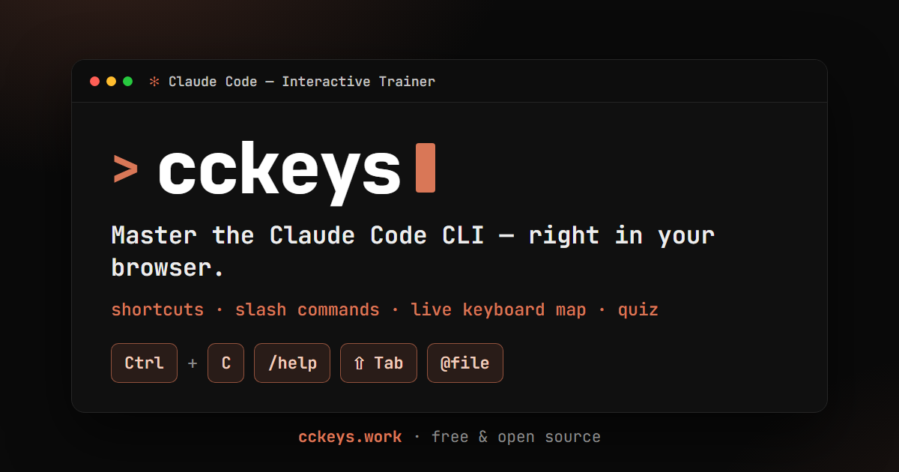
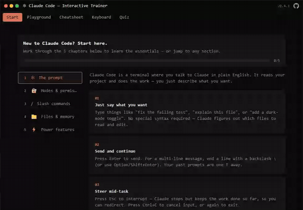
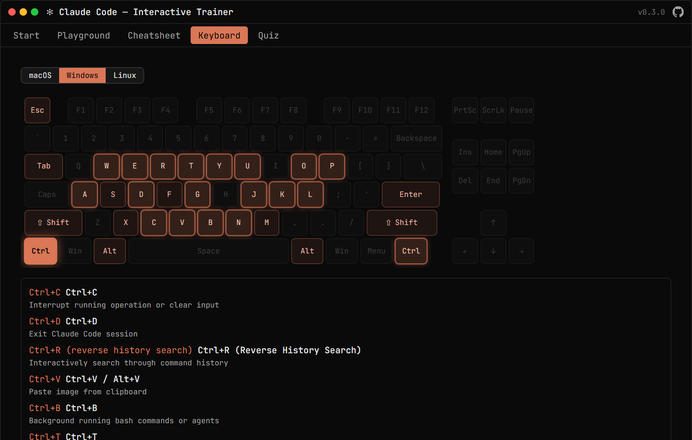
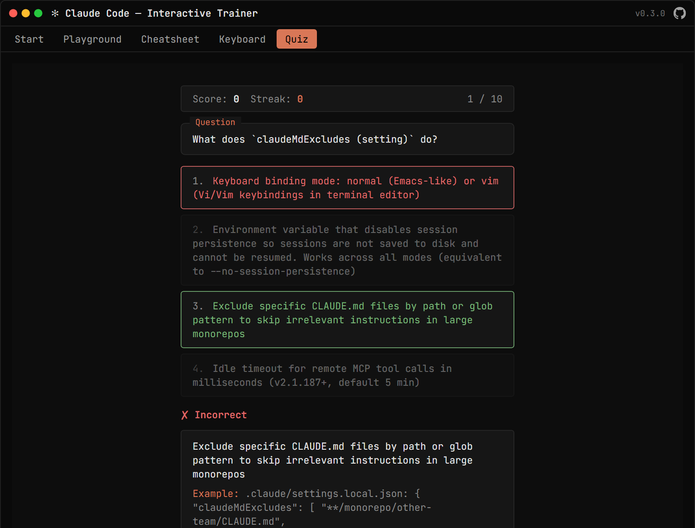

<p align="center">
  <a href="https://cckeys.work"></a>
</p>

<h1 align="center">cckeys — Claude Code Interactive Trainer</h1>

<p align="center">
  <a href="https://cckeys.work"></a>
  <a href="LICENSE"></a>
</p>

> An interactive, terminal-styled web app to help you **master the Claude Code CLI** — like the
> shortcut-visualizer pages for Photoshop/Illustrator, but playful and hands-on.

**🔗 Live at [cckeys.work](https://cckeys.work)**

The whole app presents as **one Claude Code window**. You learn by doing — no install, nothing to
configure, runs entirely in your browser.

<p align="center">
  <a href="https://cckeys.work"></a>
</p>

## Features

- ⌨️ **Keyboard visualizer** — a full keyboard where shortcut keys glow; click a key to light up its
  partner keys and see every shortcut on it (macOS / Windows / Linux views).
- 🔍 **Cheatsheet** — searchable, filterable catalog of every Claude Code feature, with examples.
- 🎮 **Playground** — a safe *simulated* Claude Code terminal (nothing executes) to try commands.
- 🧠 **Quiz** — multiple-choice and type-the-shortcut questions, scored, with explanations.
- 🚀 **Start here** — a guided, chaptered track for newcomers (prompt → modes → commands → memory → power features).

Built on a curated catalog of **Claude Code features across 12 domains**, audited against the official docs.

## A look inside

**⌨️ Keyboard visualizer** — click a key and its shortcuts + partner keys light up:



**🧠 Quiz** — test yourself with instant feedback:



## Tech stack

Vite · React 18 · TypeScript (strict) · Tailwind CSS v4 · Vitest · Playwright · pnpm.
Static build, no backend, no tracking.

## Getting started

Requires [Node.js](https://nodejs.org) ≥ 20 and [pnpm](https://pnpm.io).

```bash
git clone https://github.com/sepivip/claude-code-visualizer.git
cd claude-code-visualizer
pnpm install
pnpm dev          # http://localhost:5173
```

### Scripts

| Command | What it does |
|---|---|
| `pnpm dev` | Start the dev server |
| `pnpm build` | Type-check + production build to `dist/` |
| `pnpm test` | Run the unit test suite (Vitest) |
| `pnpm test:e2e` | Run the Playwright smoke test |
| `pnpm build:catalog` | Regenerate `src/data/catalog.ts` from the content source |

## How it works

The content lives in [`content/cc-catalog.raw.json`](content/cc-catalog.raw.json) and is transformed
into typed data (`src/data/catalog.ts`) by `pnpm build:catalog`. The keyboard derives its shortcut
map from that catalog at runtime. It's a fully static site — `pnpm build` produces a `dist/` folder
you can host anywhere.

## Contributing

Issues and PRs welcome! Spotted a wrong or missing shortcut? Open an issue or edit
`content/cc-catalog.raw.json`. Please keep `pnpm test` and `pnpm build` green.

## License

[MIT](LICENSE) © Beka Zakaidze

---

*An educational project. Not affiliated with Anthropic.*
